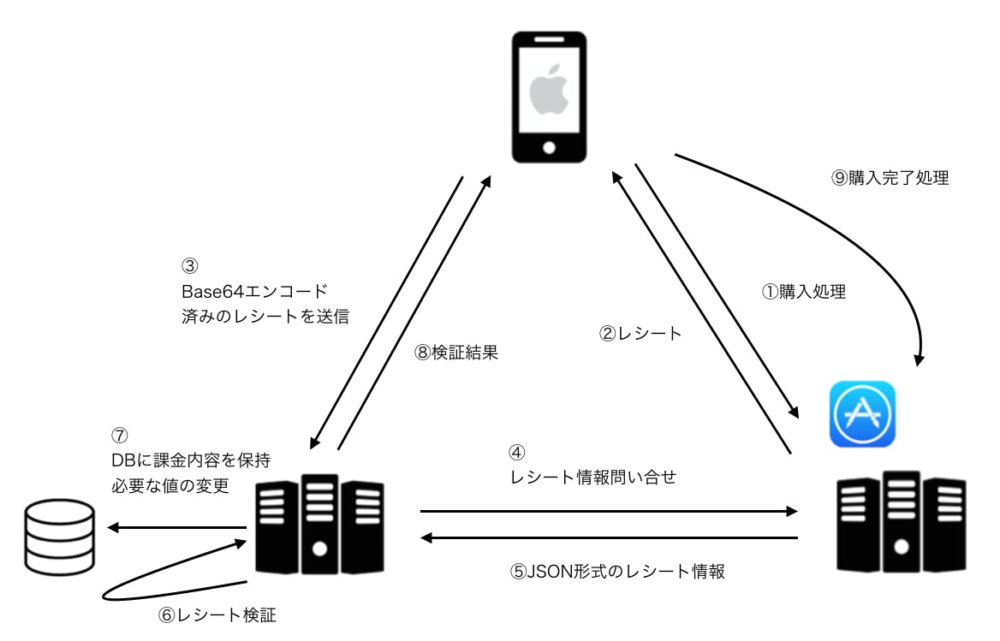

[アイテム課金Issue](https://github.com/nana-music/scrum/issues/3104)

## 課金の種類
### 1. 非消費型(自動購読)課金の場合
- AppleIDごと
- 機種変更によるアプリ再インストールを行なっても、復元できる

### 2. 消費型(アイテム)課金

- 購入履歴がデバイス単位での管理になるAppleIDに紐づいていない
- 機種変更によるアプリ再インストールを行なたら、復元できない。

transactionを一度終了したら、復元できないため、
3と8に失敗した場合のtransactionの扱いをどうするか?

## 消費型(アイテム)課金

### 未完了のtransactionがある時(9の処理が完了するまでに)、考えるべき異常系

#### 1. ユーザがログアウトした場合
> 消耗型プロダクトと非更新購読の情報は、支払いが行われるとシートに追加され、トランザクション
を終了するまでレシート上に残ります。トランザクションの終了後、この情報はレシートが次に更新
されるとき、たとえばユーザが次に購入を行ったときに削除されます。

この未完了のtransactionはapple idと紐づいている。
未完了のtransactionが終了するまで、レシート情報とセットにして、現在ログイン中のnana idと紐づけて保存しないといけない (UserDefault?)

[参考: レシートの保存について](https://qiita.com/kayo_h/items/4adeed1048064d9f41f2)

もしくは、ログアウトしたユーザのtransactionを削除する。この場合、課金はされているけど、
結局コインは使えない状態(サービス的にどう?)

### 要調査

- Appleとの課金に成功した後、transactionを消さないでおいたらどうなるんだっけ?
レシートにはtransactionが存在するはずだから、ちゃんと消されているかは、サーバー側と連携してテストを行う

- リジェクト対象事項

#### ポイントに有効期限をつけるとリジェクトされるかもしれない。
[App Store Review Guidelines](https://developer.apple.com/app-store/review/guidelines/#purchasing-currencies)
> 3.1.1 In-App Purchase:  
Any credits or in-game currencies purchased via in-app purchase may not expire, and you should make sure you have a restore mechanism for any restorable in-app purchases.

### 要件について

未消費で枠が終了した分に関しては終了後に返P処理を行う（消費されない）
→　コインは保持しない(消費しなかった分はポイントに戻る)
→　返P処理って具体的にどういうこと? コインからポイントになる
→　コイン使ったけど、エラーが発生または、ポストがLiveを終了させたらどうなる?　

## 実装時の問題

ポイント: サーバー管理?  
コイン: クライアント管理?

アイテム課金のDB何使う？ CoreData?

## API 
 transaction identer とUser idを紐づけて、idが違ったら、キャンセル
 一緒だったら

 消費型と非消耗型のAPIは異なるため、上記で判定する

https://github.com/nana-music/nana_api_v2/pull/3663

## うた玉

firebase　の変更をみる
チャンネルって今いるチャンネルだけだっけ？

ポイント表示箇所では、つどAPI叩く

ポイントとメニューの

