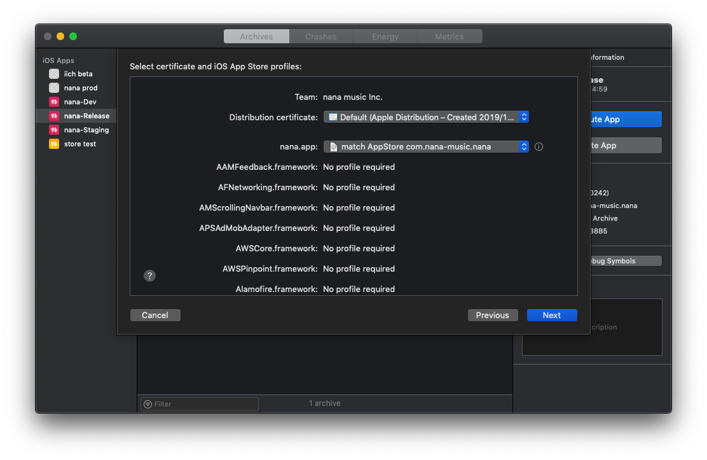
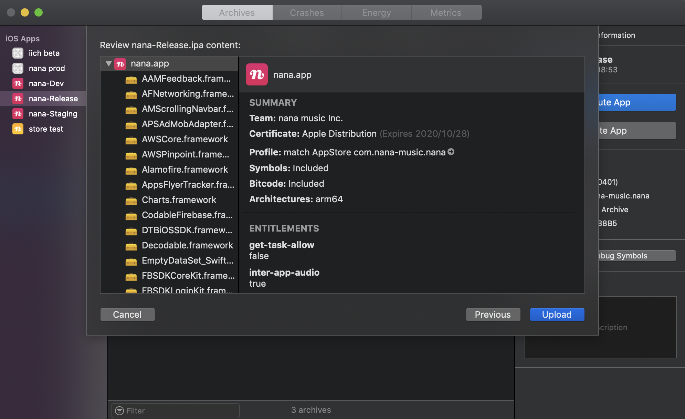

## サブミットの仕方

1. 対処のbranchでcheckoutして fastlane set up

2. ターゲット: nana-realease(間違えないで!) > 実機を選択(シュミレータだとできない)　> archive

    ※ cleanしないとダメな時ある.

3. DistributeApp > Apple Store Connect > Next > Upload  
optionは全て選択  
certificationは一番上を選択






4. App Store Connectサイトに行って, リリース用のAppでアクティビティ


## master < develop PR作成　コマンド

念の為、developにいる状態で、developを最新にする
```
bundle exec git-pr-release
```


